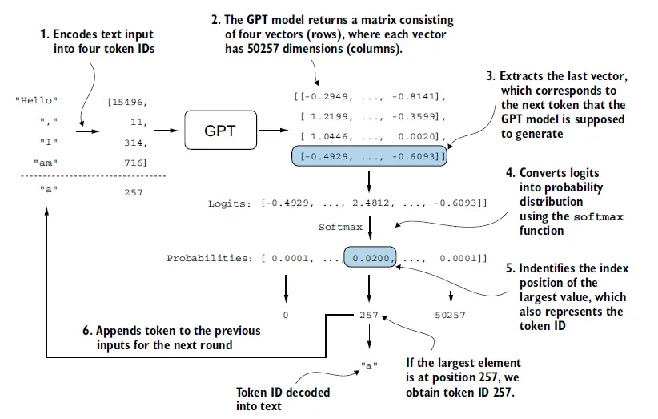

# Understanding Transformers in LLMs (Large Language Models)

Large Language Models (LLMs) like GPT-3, GPT-4, and others rely on a neural network architecture called **Transformers**. Introduced in the 2017 paper *"Attention Is All You Need"* by Vaswani et al., Transformers have revolutionized NLP (Natural Language Processing) by enabling efficient processing of long text sequences.

## **Key Components of a Transformer Model**
A Transformer consists of several key components:

1. **Tokenization** – Converts text into numerical tokens.
2. **Embedding Layer** – Maps tokens to high-dimensional vectors.
3. **Positional Encoding** – Adds order information to embeddings.
4. **Transformer Layers** – The core of the model, consisting of:
   - **Multi-Head Self-Attention** – Determines word relevance.
   - **Feedforward Neural Network (FFN)** – Processes each token independently.
   - **Layer Normalization & Residual Connections** – Helps training stability.
5. **Final Output Layer** – Predicts the next token in sequence generation.

---

## **Step 1: Tokenization (Converting Text to Numbers)**
Before a Transformer can process text, the input must be converted into numbers using **tokenization**.

### **How Tokenization Works**
- Each word or subword is assigned a unique index from a vocabulary.
- Tokenization strategies include:
  - **Word-based**: Each word is a token (inefficient due to large vocabulary size).
  - **Character-based**: Each character is a token (inefficient due to long sequences).
  - **Subword-based** (Used in LLMs like GPT): Uses **Byte-Pair Encoding (BPE)** or **WordPiece**, splitting words into subwords when needed.

#### **Example of Tokenization**
Let’s tokenize the sentence: **"I love programming"**

| Token  | Index |
|--------|------:|
| "I"    | 100  |
| "love" | 204  |
| "pro"  | 305  |
| "gram" | 412  |
| "ming" | 521  |

So, the sentence *"I love programming"* is represented as: `[100, 204, 305, 412, 521]`

---

## **Step 2: Embedding Layer (Turning Tokens into Vectors)**
After tokenization, tokens are converted into **embeddings**—high-dimensional vectors that capture the meaning of words.

### **How Embeddings Work**
- Each token (e.g., "I", "love", "pro") is mapped to a **768-dimensional vector** (in GPT-2) or **larger** (e.g., 12288 in GPT-4).
- These embeddings are **learned** during training.
- Similar words get similar vector representations.

---

## **Step 3: Positional Encoding (Adding Word Order)**
Transformers **don’t have recurrence (RNNs) or convolution (CNNs)**, so they need a way to **learn the order** of words in a sentence.

### **How Positional Encoding Works**
- Embeddings alone don’t distinguish between *"dog bites man"* and *"man bites dog"*.
- **Positional encodings** add unique signals using **sine and cosine functions**.

---

## **Step 4: Transformer Layers**
After encoding, the token embeddings are passed through multiple **Transformer layers**, consisting of:

1. **Multi-Head Self-Attention**
2. **Feedforward Neural Network (FFN)**
3. **Layer Normalization & Residual Connections**

### **How Self-Attention Works**
**Self-attention** determines the relevance of words to each other.

#### **1. Compute Query (Q), Key (K), and Value (V) Matrices**
- Each word’s embedding is transformed into three matrices: Query, Key, and Value.

#### **2. Compute Attention Scores**
- Attention scores are computed by multiplying **Query (Q) with the Key (K)** and normalizing.

\[
Attention = softmax\left(\frac{QK^T}{\sqrt{d_k}}\right)
\]

#### **3. Multiply Attention Scores with V (Value Matrix)**
\[
Output = Attention \times V
\]

---

## **Step 5: Multi-Head Attention**
Instead of a **single** attention mechanism, Transformers use **multiple heads** (e.g., 12 in GPT-2).

- Each head **focuses on different aspects** of the sentence.
- Heads are combined to get a **richer** representation.

---

## **Step 6: Feedforward Neural Network (FFN)**
After attention, each token goes through an **FFN**, processing each word **individually**.

\[
FFN(x) = ReLU(W_1 x + b_1) W_2 + b_2
\]

- Expands the **hidden dimension** (e.g., 768 → 3072 → 768).
- Adds **non-linearity** to improve learning.

---

## **Step 7: Final Output (Next Token Prediction)**
At the final layer:
1. The output matrix is passed to a **Softmax Layer**.
2. This generates a **probability distribution** over vocabulary words.
3. The highest-probability token is selected as the **next word**.

---

## **Summary of Transformer Architecture in LLMs**

| Step | Component | Purpose |
|------|------------|-----------------------------|
| 1 | Tokenization | Convert text to tokens |
| 2 | Embedding | Convert tokens to vectors |
| 3 | Positional Encoding | Add order information |
| 4 | Multi-Head Attention | Determine word relationships |
| 5 | FFN | Process tokens individually |
| 6 | Output Layer | Predict next token |

---

## **Why Are Transformers Powerful?**
✅ **Handles long sequences efficiently** – Unlike RNNs, which struggle with long dependencies.  
✅ **Parallelizable** – Unlike sequential models (RNNs), Transformers compute all tokens simultaneously.  
✅ **Scales well** – GPT-4, PaLM, and other large models use thousands of Transformer layers.

This is why **Transformers power all modern AI models**, including ChatGPT, BERT, T5, and Llama.
